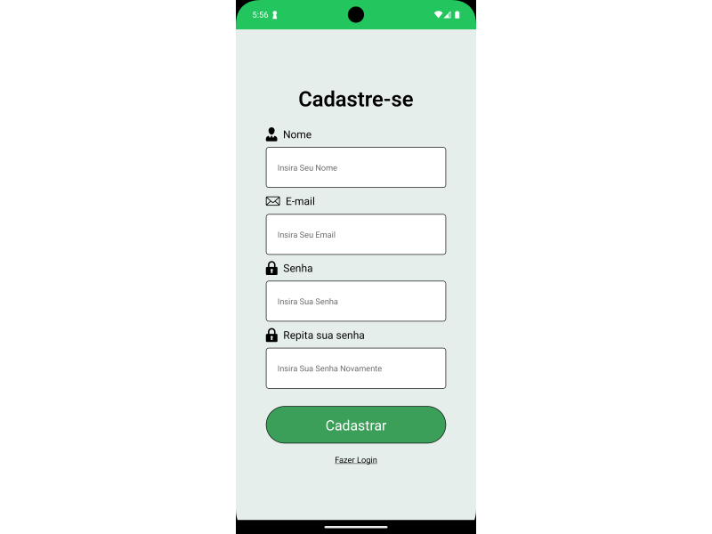
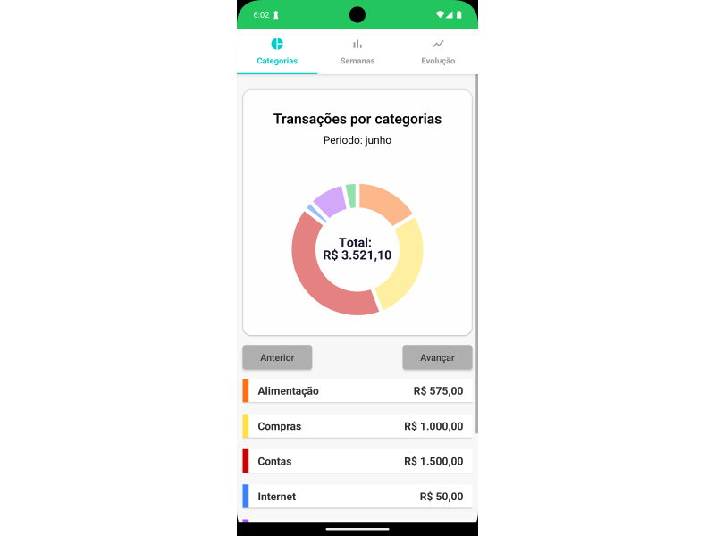
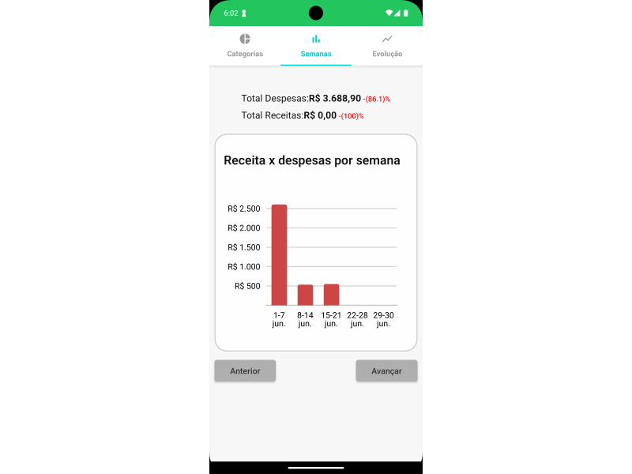
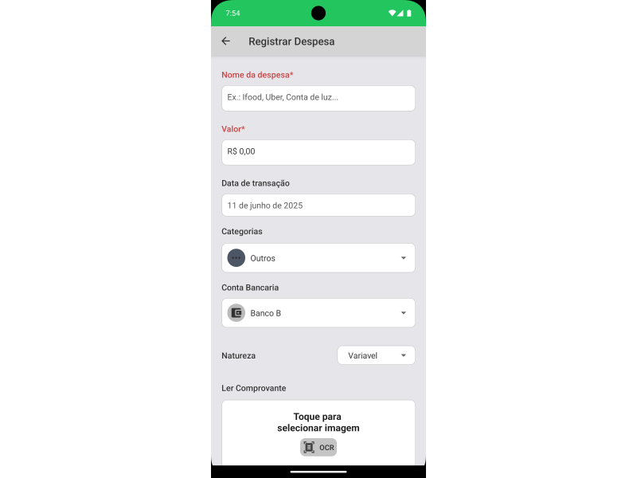

# Poupe Fácil - Aplicativo de Gerenciamento Financeiro

Aplicação web desenvolvida como parte de um Trabalho de Conclusão de Curso. O sistema oferece funcionalidades essenciais para controle financeiro com foco em experiência do usuário, organização visual e segurança de dados.

## Tecnologias Utilizadas

- React Native (JSX)
- Node.js Express
- PostgreSQL
- Expo GO

## Estrutura do projeto

Poupe-Facil/ 
├── backend/ # Backend da aplicação (Node Js Express) 
│ ├── controller/ # Lógica das rotas 
│ ├── middleware/ # Middlewares personalizados 
│ ├── models/ # Modelos de dados 
│ ├── routes/ # Endpoints da API 
│ ├── services/ # Camada de serviços 
│ ├── utils/ # Funções auxiliares 
│ ├── views/ # Templates ou respostas visuais 
│ └── tests/ # Testes automatizados 
├── src/ # Frontend (React Native) 
│ ├── components/ # Componentes reutilizáveis 
│ ├── context/ # Estado global com Context API 
│ ├── hooks/ # Custom React hooks 
│ ├── routes/ # Definição de rotas do app 
│ ├── screens/ # Telas da aplicação 
│ └── utils/ # Utilitários e helpers

## Capturas de tela

### Autenticação

- Tela de Login  
  

- Tela de Cadastro  
  

### Pagina Principal

- Pagina inicial
  

- Menu principal
  

### Gráficos

- Gráfico de rosca (gastos por categoria)
  

- Gráfico de barra (receitas x despesas)
  

- Gráfico de linha (evolução semanal dos gastos)
  

### Outros

- Tela de transações 
  

- Tela de orçamento 
  

- Tela de metas financeiras 
  

- Criando transação por formulario
  

- Criando transação por texto
  

- Review de ultimos gastos
  

- Relatório financeiro
  

## Status do Projeto

Este projeto foi finalizado em **06/2025** como parte de um Trabalho de Conclusão de Curso. A instância de backend e serviços associados foi descontinuada após a entrega acadêmica.

---

## Direitos Autorais

© 2025 Gabriel Grécia. Todos os direitos reservados.

---
